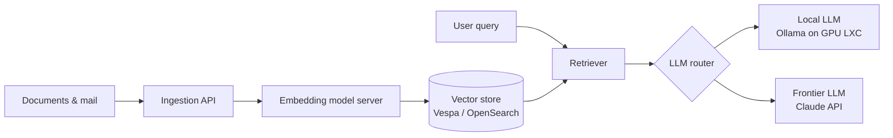

# On-Prem AI / RAG ｜ 地端 AI／RAG
{: .no_toc }

  
On this page ｜ 本頁

- TOC
{:toc}

A self-hosted Retrieval-Augmented Generation stack: documents and mail are
ingested, embedded, and indexed on-prem; queries retrieve from a vector store
and are answered by a mix of a **local LLM** (for cheap/private inference) and a
**frontier API LLM** (for quality).

一套自架的 RAG（檢索增強生成）棧：文件與郵件在地端被 ingest、embedding、建索引；查詢
時從向量庫檢索，再由**本地 LLM**（便宜／隱私）與**前沿 API LLM**（品質）混合作答。

## Architecture ｜ 架構

## The stack ｜ 技術棧

Built on **Onyx** as the application/orchestration layer, with the supporting
services it needs:

以 **Onyx** 作為應用／編排層，搭配它需要的支援服務：

| Component ｜ 元件 | Technology ｜ 技術 |
|---|---|
| Orchestration / UI ｜ 編排／介面 | Onyx (API server, web, background workers) |
| Vector / search ｜ 向量／檢索 | Vespa · OpenSearch |
| Relational + cache ｜ 關聯 + 快取 | PostgreSQL · Redis |
| Embedding ｜ 向量化 | dedicated model server (CPU) ｜ 專用 model server（CPU） |
| Local inference ｜ 本地推論 | Ollama, GPU-passthrough LXC ｜ Ollama，GPU passthrough LXC |
| Frontier inference ｜ 前沿推論 | Claude API |

## Engineering realities ｜ 工程現實

- **Split inference by cost & privacy.** A small local model on a passed-through
  GPU handles routine/sensitive inference; a frontier API model is called when
  answer quality justifies it. ｜ **按成本與隱私拆分推論。** GPU passthrough 上的小型
  本地模型處理日常／敏感推論；需要答案品質時才呼叫前沿 API 模型。
- **Hardware dictates topology.** Embedding and vector search are CPU- and
  memory-hungry; older CPUs lacking modern vector instructions forced parts of
  the index tier onto separate, better-suited hardware. The lesson: in on-prem
  RAG, the *machine* is part of the architecture. ｜ **硬體決定拓樸。** embedding 與
  向量檢索很吃 CPU 與記憶體；缺乏現代向量指令的老 CPU，逼得索引層的一部分得搬到另一台
  更合適的硬體。教訓是：地端 RAG 裡，*機器本身*就是架構的一部分。
- **Ingestion is the long pole.** Getting messy real-world documents and mail
  into clean, embeddable chunks is most of the work — the model is the easy part.
   **Ingestion 才是長桿。** 把雜亂的真實文件與郵件變成乾淨、可 embedding 的 chunk，
  才是大部分工作量——模型反而是簡單的那塊。

> This stack runs on the GPU-equipped [Proxmox node](virtualization.html); local
> inference lives in a GPU-passthrough LXC. ｜ 這套棧跑在具備 GPU 的
> [Proxmox 節點](virtualization.html)上；本地推論住在 GPU passthrough 的 LXC 裡。
