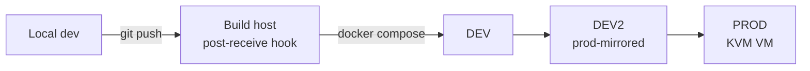

# Application Hosting ｜ 應用主機
{: .no_toc }

  
On this page ｜ 本頁

- TOC
{:toc}

Almost everything runs as **Docker** containers, orchestrated with **Compose**,
fronted by **Traefik**, kept current by **Watchtower**, and managed through
**Portainer**. New work flows along a promotion chain before it reaches users.

幾乎所有東西都以 **Docker** 容器運行，用 **Compose** 編排、**Traefik** 反代、
**Watchtower** 自動更新、**Portainer** 管理。新功能在抵達使用者前，會沿著一條
晉級鏈推進。

## The container toolkit ｜ 容器工具組

| Tool ｜ 工具 | Role ｜ 角色 |
|---|---|
| Docker / Compose | container runtime & multi-service definitions ｜ 容器執行期與多服務定義 |
| Traefik | reverse proxy + TLS termination + routing ｜ 反向代理 + TLS 終結 + 路由 |
| Watchtower | automatic image updates ｜ 映像自動更新 |
| Portainer | web management across hosts ｜ 跨主機的網頁管理 |

## The promotion chain ｜ 晉級部署鏈

Code is built on a dedicated host, deployed by a **git post-receive hook** that
runs `docker compose`, and promoted through **DEV → DEV2 → PROD**. DEV2 is a
*prod-mirrored* stage used to validate behaviour at production scale before the
final cutover.

程式碼在專用主機 build，由 **git post-receive hook** 觸發 `docker compose` 部署，
再經 **DEV → DEV2 → PROD** 晉級。DEV2 是一個*對齊正式環境規模*的階段，在最終切換前
用來驗證在正式規模下的行為。

- **Build host** doubles as the development hub — it also hosts internal tooling
  (status HUD, monitoring, notification bridges).
   **Build 主機**同時是開發中樞——也跑內部工具（狀態 HUD、監控、通知橋接）。
- **DEV2** caught more than one "works on my machine, melts under load" issue
  that a single dev stage would have missed.
   **DEV2** 攔下了不只一次「我機器上跑得動、一上量就崩」的問題——只有單一 DEV 階段
  會漏掉這類狀況。

## Reverse-proxy pattern ｜ 反代模式

Each public-facing service sits behind Traefik, which terminates TLS and routes
by hostname, so containers never expose ports directly. Watchtower then keeps
those images patched without manual pulls.

每個對外服務都坐在 Traefik 後面，由它終結 TLS 並依主機名路由，容器本身不直接對外開
port。Watchtower 再負責讓這些映像保持更新，免去手動 pull。

This same pattern shows up in the [self-hosted services](it-services.html),
the [custom OT platform](custom-apps.html), and the
[Airtable-alternative + object storage](it-services.html) stack.

同樣的模式也出現在[自架服務](it-services.html)、[自寫 OT 平台](custom-apps.html)，
以及 [Airtable 替代品 + 物件儲存](it-services.html)棧。
