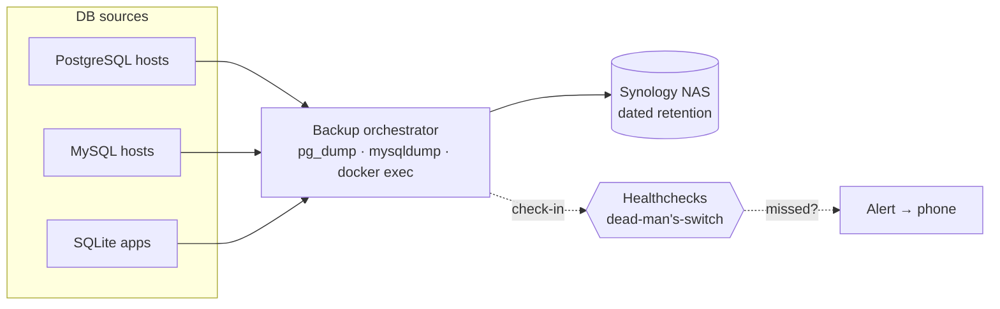

# Data & Backup ｜ 資料與備份
{: .no_toc }

  
On this page ｜ 本頁

- TOC
{:toc}

Every database in the estate is dumped on a schedule, shipped to a **Synology
NAS**, and — crucially — *verified* by a dead-man's-switch so a silently failing
backup can't hide.

整座環境裡的每一個資料庫都會定時 dump、送到 **Synology NAS**，而且——關鍵在這裡——
由一個 dead-man's-switch *驗證*，讓「悄悄失敗的備份」無所遁形。

## Backup flow ｜ 備份流

## How it works ｜ 運作方式

- **Per-engine handlers.** A small set of handlers covers each database shape:
  `pg_dump` for PostgreSQL, `mysqldump` for MySQL, `docker exec` into the
  container for databases that only listen inside Compose networks, and file
  copy for SQLite. ｜ **分引擎處理器。** 一組小處理器涵蓋每種資料庫形狀：PostgreSQL 用
  `pg_dump`、MySQL 用 `mysqldump`、只在 Compose 內網監聽的資料庫用 `docker exec`
  進容器、SQLite 直接複製檔案。
- **Dated retention on the NAS.** Dumps land under a per-source, per-date layout
  on the Synology, with a rolling retention window. ｜ **NAS 上的日期保留。** dump 以
  「來源／日期」的結構落在 Synology 上，採滾動保留期。
- **Dead-man's-switch.** Each job *checks in* with Healthchecks after a
  successful run. If a check-in is missed, the dashboard goes red and a push
  alert fires — this is what surfaces problems the backup logs alone would not.
   **Dead-man's-switch。** 每個工作成功跑完後向 Healthchecks *打卡*。一旦漏打卡，
  面板轉紅、推播告警觸發——這正是單看備份日誌看不出來的問題來源。

## A real lesson ｜ 一個真實教訓

The original backup target was a NAS whose RAID volume failed silently. Because
check-ins were not yet wired up, the failure went unnoticed for weeks. The fix
was twofold: move backups to a healthy NAS **and** put every job behind a
dead-man's-switch so "no news" can never again be mistaken for "good news."

最初的備份目的地是一台 RAID 卷默默崩潰的 NAS。由於當時還沒接打卡機制，這個失敗數週
無人察覺。修法有兩層：把備份搬到健康的 NAS，**並且**讓每個工作都掛上 dead-man's-switch，
讓「沒消息」再也不會被誤當成「好消息」。

> This is why the [observability](observability.html) layer treats *active*
> liveness and *passive* "did the job run?" as two separate, complementary
> questions. ｜ 這也是為什麼[可觀測性](observability.html)層把*主動*存活與*被動*
> 「工作到底跑了沒」當成兩個獨立又互補的問題。
