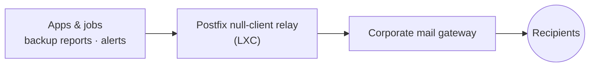

# Messaging & Mail ｜ 訊息與郵件
{: .no_toc }

  
On this page ｜ 本頁

- TOC
{:toc}

System-generated mail — backup reports, alerts, app notifications — flows through
a tiny **Postfix null-client relay** running in an **LXC container**, which hands
everything to the corporate mail gateway. Apps never speak SMTP to the outside
world directly.

系統產生的郵件——備份報告、告警、應用通知——都流經一個跑在 **LXC 容器**裡的小巧
**Postfix null-client 中繼**，由它把所有信交給公司郵件閘道。應用本身從不直接對外講 SMTP。

## Mail relay flow ｜ 郵件中繼流

## Why a null-client relay ｜ 為何用 null-client 中繼

- **One outbound path.** Every host points its mail at a single relay address
  instead of each app carrying its own SMTP credentials. ｜ **單一出口。** 每台主機
  把信指向同一個中繼位址，而不是每個應用各自帶 SMTP 帳密。
- **No app-side secrets.** The relay accepts mail from trusted internal networks
  and forwards it, so applications don't store mail passwords at all. ｜
  **應用端零祕密。** 中繼只接受來自受信任內網的信再轉發，應用端完全不必存郵件密碼。
- **Tiny footprint.** A null-client Postfix needs almost nothing — it's a perfect
  fit for a minimal **LXC** container rather than a full VM. ｜ **極小體積。**
  null-client 的 Postfix 幾乎不吃資源——非常適合塞進極簡 **LXC** 容器，不必動用整台 VM。
- **Single chokepoint.** Routing, rate, and sender policy live in one place,
  which also makes the whole flow easy to monitor. ｜ **單一咽喉點。** 路由、流量、
  寄件者政策集中一處，也讓整條流程容易監看。

## The corporate gateway ｜ 公司郵件閘道

The relay's upstream is the company's existing mail gateway/filter appliance —
the relay's only job is to be a clean, internal, credential-free on-ramp to it.

中繼的上游是公司既有的郵件閘道／過濾設備——中繼唯一的工作，就是當一條乾淨、內部、
免帳密的上匝道接到它。

> Delivery of these messages to a human is the same [ntfy / Zulip
> pipeline](observability.html) used for alerts; email is the channel of record,
> push is the channel of attention. ｜ 把這些訊息送到人眼前，用的是與告警相同的
> [ntfy／Zulip 管線](observability.html)；郵件是存證管道，推播是抓注意力的管道。
