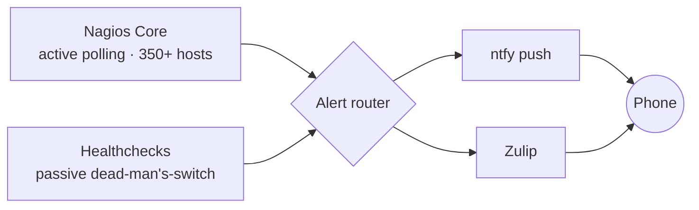

# Observability & Alerting ｜ 可觀測性與告警
{: .no_toc }

  
On this page ｜ 本頁

- TOC
{:toc}

Two complementary layers — **active** device polling and a **passive**
dead-man's-switch — fan into a single push pipeline that reaches the phone.

兩個互補的層次——**主動**設備輪詢與**被動** dead-man's-switch——匯入單一條推播管線，
最終抵達手機。

## Active vs passive ｜ 主動 vs 被動

| Layer ｜ 層 | Tool ｜ 工具 | Answers ｜ 回答的問題 |
|---|---|---|
| Active ｜ 主動 | **Nagios Core** | Is this device / service **online right now**? ｜ 這台設備／服務**現在在線嗎**？ |
| Passive ｜ 被動 | **Healthchecks** | Did this backup / cron job **run and succeed**? ｜ 這個備份／排程**跑了且成功了嗎**？ |

- **Active (Nagios Core)** polls physical and network gear — cameras, access
  points, switches, UPS units, NAS, hypervisors — by ping/SNMP/port. It's the
  inherited network operations view: *up or down, now*.
   **主動（Nagios Core）**以 ping／SNMP／port 輪詢實體與網路設備——攝影機、AP、
  交換器、UPS、NAS、虛擬層——這是既有的網路維運視角：*此刻在不在線*。
- **Passive (Healthchecks)** is a dead-man's-switch: jobs check in on a
  schedule, and a *missing* check-in is the signal. It catches the failure mode
  that polling can't see — a job that silently stopped running.
   **被動（Healthchecks）**是 dead-man's-switch：工作按表打卡，*漏打卡*本身就是訊號。
  它抓的是輪詢看不到的失效模式——一個悄悄停掉的工作。

> They overlap by design without duplicating: one watches **devices**, the other
> watches **jobs**. ｜ 它們刻意互補而不重複：一個盯**設備**，一個盯**工作**。

## The push pipeline ｜ 推播管線

Alerts from both layers converge and are delivered through **ntfy** and
**Zulip**. ntfy is exposed via a **Cloudflare Tunnel**, so phone push works
without opening any inbound port on the network.

兩層的告警匯流後，經 **ntfy** 與 **Zulip** 送出。ntfy 透過 **Cloudflare Tunnel**
對外，因此手機推播不需要在網路上開任何對內 port。

- **ntfy** — lightweight topic-based push to the phone ｜ 輕量、以 topic 為單位的
  手機推播
- **Zulip** — threaded team chat; alerts post into dedicated streams/topics ｜
  threaded 團隊聊天；告警貼進專屬 stream／topic
- **Cloudflare Tunnel** — outbound-only secure ingress, no port-forwarding ｜
  只出不進的安全入口，免 port forwarding

This is the delivery layer that the [backup](data-and-backup.html)
dead-man's-switch and device monitoring both ride on.

這就是[備份](data-and-backup.html) dead-man's-switch 與設備監控共用的送達層。
