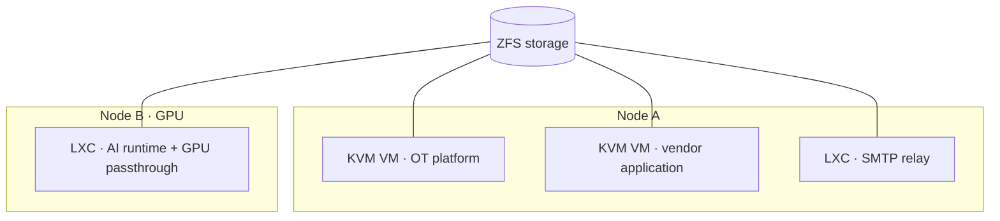

# Virtualization ｜ 虛擬化
{: .no_toc }

  
On this page ｜ 本頁

- TOC
{:toc}

The foundation of the stack is a small **Proxmox VE** estate: two nodes running
a mix of full **KVM virtual machines** and lightweight **LXC containers**, on
**ZFS** storage, with **GPU passthrough** on the node that serves AI inference.

整座技術棧的地基是一組小型 **Proxmox VE**：兩個節點，混跑完整 **KVM 虛擬機**與輕量
**LXC 容器**，底層用 **ZFS**，承載 AI 推論的那台還做了 **GPU passthrough**。

## Why Proxmox ｜ 為什麼選 Proxmox

- **One platform, two workload shapes.** KVM for full-OS guests (vendor apps,
  the OT platform), LXC for cheap single-purpose services (a mail relay, an AI
  runtime) that don't need a whole kernel.
   **一個平台、兩種工作負載形狀。** KVM 給需要完整 OS 的客體（廠商應用、OT 平台），
  LXC 給便宜的單一用途服務（郵件中繼、AI runtime），不必為它們扛一整顆 kernel。
- **ZFS** for snapshots and storage integrity. ｜ 用 **ZFS** 做快照與儲存完整性。
- **API-first.** The hypervisor is driven through its REST API for automation,
  not just the web console. ｜ **API 優先**：虛擬層透過 REST API 自動化操作，不只靠
  網頁主控台。
- **GPU passthrough** lets one node hand a physical GPU to a container for local
  LLM inference. ｜ **GPU passthrough** 讓其中一台把實體 GPU 交給容器，跑本地 LLM 推論。

## Layout ｜ 佈局

> Node/guest labels are generic by design — no hostnames or addresses.
> 節點／客體標籤刻意通用化——不含主機名或位址。

## What runs on top ｜ 上面跑什麼

The VMs and containers here host most of what the rest of this site describes:
the [container application hosts](application-hosting.html), the
[custom-built OT platform](custom-apps.html), the
[SMTP relay](messaging-mail.html), and the
[AI / RAG runtime](ai-rag.html).

這裡的 VM 與容器承載了本站其餘篇幅描述的大部分內容：
[容器應用主機](application-hosting.html)、[自寫 OT 平台](custom-apps.html)、
[SMTP 中繼](messaging-mail.html)，以及 [AI／RAG runtime](ai-rag.html)。
